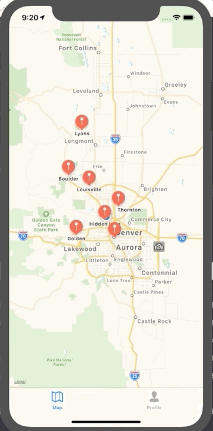

# camperApp

This is a sample project that I've created to learn more about MapKit, Google Firebase, and general networking with a custom server.

# iOS

- Asks for users location and then displays it (and tracks) if user grants permission.
- Uses UIGesterRecognizer to add locations to a map when a user performs a long tap anywhere on the map.
- Uses UIAlertController to add a name to the location before the location is added.
- After tapping on an location and clicking on the info icon, a user can edit the name of the location.
- All adds/edits are saved to a test server

# Server side notes

This project saves all new locations and edits to a Node.js service hosted on Heroku.
This project has very basic capabilities for login/registration using Google Firebase.

# GIFs

Editing an existing Campsites name:

Adding a new campsite:

New account creation:

